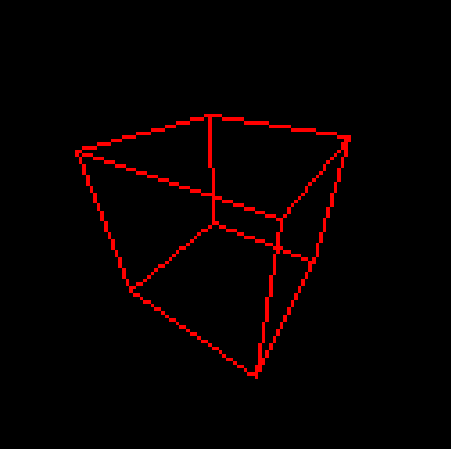
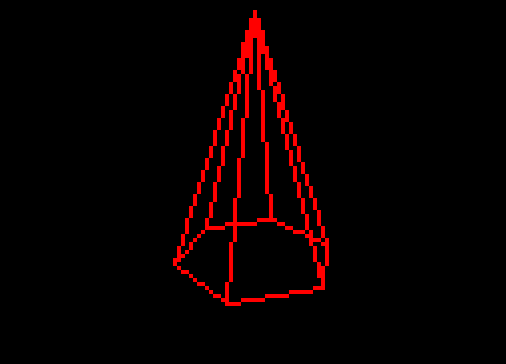

<h1 align = "center"> Atividade Prática 2 - Pipeline Gráfico </h1>

<h3 align="center"> João Victor Rodrigues Galvão - 20190172620</h3>
<h3 align="center"> Yvson Nunes Figueiredo - 20190019716</h3>

O Trabalho desenvolvido aqui teve como objetivo implementar o Pipeline Gráfico estudado na cadeira de Introdução à Computação Gráfica. O primeiro passo adotado foi o de estabelecer a lista de vértices e a lista de arestas com o fito de descrever os objetos que seriam renderizados. Desse modo, por conseguinte,  foi estabelecido quais seriam as transformações que formariam a **Matriz Model** e  que levariam os objetos do **Espaço do Objeto** para o **Espaço do Universo**. Uma vez estando no espaço do objeto e com as informações da câmera(posição,look_at e up), foi construída a **Matriz View** que estabeleceu o **Espaço da Câmera**. Ademais, transformamos os vértices para o **Espaço de Recorte**, através da distância **d** entre o plano de projeção e o centro de projeção da câmera com a **Matriz de Projeção** , e consecutivamente para o **Espaço homogêneo** usando a divisão pela coordenanda **W**. Finalizando os estágios geométricos, fizemos a tranformação para o **Espaço de Tela**(bidimensional e com domínio inteiro) por intermédio da **Matriz Viewport** feita por intermédio de uma translação e uma escala.

## Estratégias Utilizadas no desenvolvimento

Como o objetivo do trabalho foi a implementação dos estágios geométricos, foi utilizada como ferramenta para cálculos algébricos as funções da biblioteca ThreeJs. Ademais, para debug e validação de cada transformação, foram utilizados dados dos exemplos feitos em aula.

## Exemplo 1

Para a construção do cubo, foi utilizada a matriz identidade como matriz model e os parâmetros de câmera especificados no documento da atividade.

 

<b> Cubo</b>

## Exemplo 2

Para a construção da pirâmide, após a definição dos vértices e arestas, foi realizada uma rotação em torno do eixo x de -90°, além de um ajuste na posição da câmera, para melhorar o enquadramento.

 

<b>Pirâmide com base hexagonal</b>

## Exemplo 3

Na construção do símbolo do jogo The Sims, mais uma vez foram definidos os vértices e as arestas, em seguida foi realizada a rotação em torno do eixo z de 30° para melhorar a visualização, a câmera também foi ajustada para melhorar o enquadramento.

 

<b>Símbolo do jogo The Sims</b>

Uma possível melhoria a ser implementada é uma função que faça rotações em multiplos eixos.
## Referências

https://www.cs.uaf.edu/2013/spring/cs493/lecture/01_24_vectors.html (**exemplos de operações com vetores no ThreeJs**)

https://gamemath.com/book/matrixtransforms.html (**Matrices and Linear Transformations**)